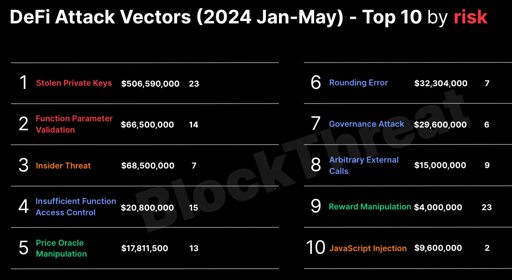

The Critical Importance of Web3 Security: A Comprehensive Analysis

**Introduction**

Web3 security has become paramount as decentralized technologies continue to manage billions of dollars in digital assets. Unlike traditional financial systems, Web3 protocols are immutable and autonomous, meaning security vulnerabilities can have immediate and irreversible consequences.

**Key Security Considerations**
1. Financial Impact

Smart contract exploits have resulted in losses exceeding $3 billion in 2022 alone
Compromised protocols can affect thousands of users simultaneously
Lack of traditional insurance or recovery mechanisms in most cases

2. Immutability of Blockchain

Once deployed, smart contracts cannot be easily modified
Vulnerabilities may remain exploitable until a new version is deployed
Users must migrate to new versions, creating additional complexity

3. Interconnected Ecosystem

DeFi protocols often interact with multiple other protocols
Vulnerabilities in one protocol can cascade throughout the ecosystem
Flash loan attacks can exploit multiple vulnerabilities simultaneously

**Common Security Challenges**
Smart Contract Vulnerabilities

Reentrancy attacks
Integer overflow/underflow
Access control issues
Logic errors in business implementation
Oracle manipulation

**Infrastructure Risks**

Front-end attacks
DNS hijacking
Private key compromises
RPC node vulnerabilities

**Best Practices for Security**
Development Phase:Developers must have security mindset when building a protocol!
Extensive testing in testnet environments:Invariant/Fuzzing test 
Implementation of emergency pause mechanisms
Formal verification of critical functions

- Web3 security is not just an optional feature but a fundamental requirement for the ecosystem's survival and growth. As the space continues to evolve, security measures must adapt and improve to protect users and assets while maintaining the core principles of decentralization and trustlessness.

**Web3 Security Tooling**
# Tooling Overview

| **Category** | **Static Analysis** | **Invariant/Fuzzing** | **Formal Verification** | **AI** | **Manual Review** | **Scoping**          |
| ------------ | ------------------- | --------------------- | ----------------------- | ------ | ----------------- | -------------------- |
| **Tool**     | **Slither**         | **Foundry**           | **Certora**             | -      | -                 | **Solidity Metrics** |
|              | **Aderyn**          | **Echidna**           | **Solidity SMTChecker** | -      | -                 | **cloc**             |
|              |                     | **Consenys**          | **Maat**                | -      | -                 |                      |
|              |                     | **Manicore**          | -                       | -      | -                 |                      |

In this  research i'll be covering a few web3 expliots that ii ahve come accross, the research will contiune to grow.
